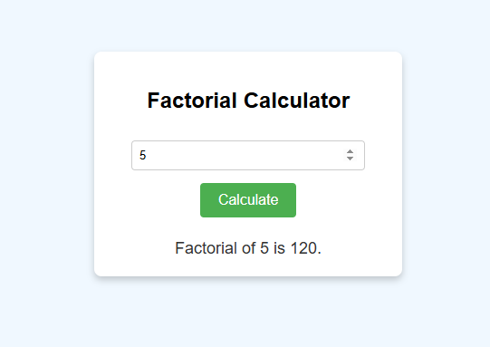

# 📟 Factorial Calculator

A simple and responsive web app that calculates the factorial of a non-negative number. Built using **HTML**, **CSS**, and **JavaScript**, this beginner-friendly project is great for learning basic DOM manipulation and user input validation.

## ✨ Features

- ✅ Instantly calculate the factorial of any non-negative number  
- ✅ Input validation with helpful error messages  
- ✅ Clean and modern UI  
- ✅ Fully responsive and mobile-friendly  
- ✅ Easy to understand code — perfect for beginners!

## 🚀 Deployment
  
This Calculator UI project is deployed using ChatGPT. 
You can access the deployed application by following this link: [Calendar UI GitHub Pages](https://github.com/Code-With-Anik/Fibonacci-Calculator)

## 🛠️ Technologies Used

- **HTML5** — Structure and layout  
- **CSS3** — Styling and responsiveness  
- **Vanilla JavaScript** — Logic and interactivity  

## 🧮 What Is a Factorial?

A **factorial** of a number _n_ (written as _n!_) is the product of all positive integers from 1 to _n_.

Example:
5! = 5 × 4 × 3 × 2 × 1 = 120

## 💡 How to Use

1. Clone or download this repository  
2. Open the `index.html` file in your browser  
3. Enter a non-negative number  
4. Click **Calculate** to see the result!

## 📂 Folder Structure

factorial-calculator/
├── index.html
├── style.css
├── script.js
└── README.md

## 🎯 Ideal For

- Web development beginners  
- JavaScript practice  
- Building your project portfolio  
- Small coding exercises and challenges

## 📌 Future Enhancements (Optional)

- Add support for large numbers using BigInt  
- Animate result display  
- Add dark mode toggle  

## 📃 License

This project is open-source and available under the [MIT License](LICENSE).

## 🙌 Contributions

Pull requests and stars are welcome!  
If you have suggestions or ideas, feel free to open an issue or fork the project.

---

Made with ❤️ by Anik
